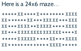
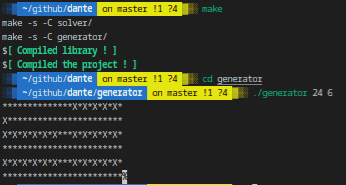
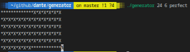

# dante

## DESCRIPTION
The goal of this project is to `generate mazes` (in a reasonable amount of time), `solve them` (in a reasonable amount of time), and print the solution.

> :warning: System functions and libC are allowed, but no external libraries

You must have 2 folders : solver with a binary named “solver” in it, generator with binary named “generator” in it.
Each folder must contain a Makefile compiling the binary and a Makefile at the root must compile all binaries.

> The Makefile at the root must compile all of the binaries.

#### What is a maze ?
Here is the `maze format` description:

    - Mazes are rectangular.
    - They are coded in ASCII.
    - The ‘X’s represent the walls and the’*’s represent the free spaces.
    - It is possible to move to the four surrounding squares (up, down, right, left.
    - “Start” is in the upper left-hand corner (0;0)
    - “Finish” is in the bottom right-hand corner.
    - A solution is a series of free, adjacent squares, from “Start” to “Finish” included.
    - “Start” and “Finish” can be occupied. In this case, there is no solution.
    - The last line of the maze doesn’t terminate with a return line.
    - Resolution: in order to write the solution in the maze, we use ‘o’ for the solution path



##### Imperfect Maze

An imperfect maze must contain clusters.  
The requirements are the same as for perfect mazes.  
The generation method is up to you, but it must work in an acceptable amount of time.  

`Input`: maze size (width/height).

`Output`: a maze with the required size on the standard output.  

> :warning: The maze must have at least one solution.  

##### Perfect maze
A perfect maze is a maze that has no loops and no clusters; therefore, following a wall makes us cross the entire maze.  
The generation method is up to you, but it must work in an acceptable amount of time.  

`Input`: maze size (width/height).

`Output`: a maze with the required size on the standard output.  

> :warning: The maze must have a solution.  
> :bulb: The maze should be really perfect.  
> :bulb: The maze should be really really perfect.

##### Escaping the maze
Now it’s time to solve those mazes you’ve generated... and some more that our very very efficient AI generated for you.
Your resolution program should take the name of a file containing the maze and write the solution on the standard output.
You can choose the algorithm you want but be careful, you will be ask to solve perfect and imperfect mazes.

## Prerequisites
What do you need to install ?
```bash
GlibC
gcc
make
```

## How to Build
Clone and go into `dante` directory.
Then, 
```bash
$ make
```

## USAGE
Go into `generator` directory.
```bash
$ ./generator x y [perfect]
```
| Option      | Description   |
| ----------- |:-------------:|
|x | width of the maze |
|y | height of the maze |
|perfect | for the perfect maze (`default`: imperfect) |

Go into `solver` directory.
```bash
$ ./solver file
```
| Option      | Description   |
| ----------- |:-------------:|
|file | maze in a text file |

> :neutral_face: Solver not functional

## Example

`Imperfect maze`



`Perfect maze`



## Summary
| Details      | Mouli Epitech (%) |
| ------------- |:-------------:|
| `basic`: 50% \| `basic generation`: 100% \| `advanced generation`: 0% \| `medium size generation`: 100% \| `big size generation`: 80% \| `solving`: 0% | 50% |

## WARNING
:warning: : For EPITECH Students, don't use this repository. Pay attention to :no_entry: 42