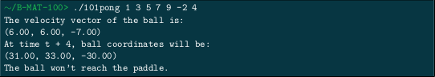
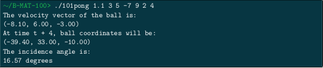

# 101pong_2019

## DESCRIPTION
#### Vectors and Video Games
The goal of this project is to work on a 3D version of this game (or of the Breakout game. . . ). Only one paddle
will be considered, located in the (Oxy) plane (which is defined by the equation z = 0).

Your program must print:
- The velocity vector of the ball,
- The coordinates of the ball after a given amount of time,
- The angle at which the ball will hit the paddle (if it will actually hit it, at anytime from t = 0).

## Prerequisites
What do you need to install ?
```bash
GlibC
gcc
make
```

## How to Build
Clone and go into `104intersection_2019` directory.
Then,
```bash
$ make
```

## USAGE
Type `./104intersection -h` to display help
```bash
./101pong x0 y0 z0 x1 y1 z1 n
```
| Option      | Description   |
| ----------- |:-------------:|
|x0 | ball abscissa at time t - 1 |
|y0 | ball ordinate at time t - 1 |
|z0	| ball altitude at time t - 1 |
|x1	| ball abscissa at time t |
|y1	| ball ordinate at time t |
|z1	| ball ordinate at time t |
|n	| time shift (greater than or equal to zero, integer) |

## Example



## Summary
| Details      | Mouli Epitech (%) |
| ------------- |:-------------:|
| `rigor`: 80% \| `vector`: 100% \| `trigonometry`: 100% \| `mathematical rigor`: 83.3% | 90.3% |

## WARNING
:warning: : For EPITECH Students, don't use this repository. Pay attention to :no_entry: 42