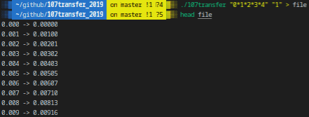
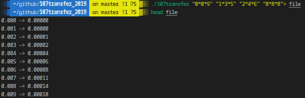

# 107transfer_2019

## DESCRIPTION
#### Polytechnical Polynomials

A laboratory performs tests on new electronic components to be integrated into its last generation chipset. Those components are entirely characterized by their transfer function, which determines frequency response; this function processes the input frequency and computes an output frequency (caracterizing the way the component amplifies or reduces the input frequency). The transfer functions of these components are rational functions, i.e. fractions such as both the numerator and the denominator are polynomials:

You have to develop a program to optimize the transfer function computations. A transfer function is defined by two strings (one for the numerator, one for the denominator), composed by the polynomial coefficients split by the ‘*’ sign.

For instance, “1\*4\*2\*6\*0\*8” stands for 8x^5 + 6x^3 + 2x^2 + 4x + 1. Your program has to print the frequency responses of the component for a every values in a range from 0 to 1, with a step of 0.001.

You should use a fast algorithm, slow programs will be considered non functional. . .
Beware of precision when using floating-point numbers!

## Prerequisites
What do you need to install ?
```bash
GlibC
gcc
make
```

## How to Build
Clone and go into `107transfer_2019` directory.
Then, 
```bash
$ make
```

## USAGE
Type `./107transfer -h` to display help
```bash
./107transfer [num den]*
```
| Option      | Description   |
| ----------- |:-------------:|
|num | polynomial numerator defined by its coefficients |
|den | polynomial denominator defined by its coefficients|

## Example




## Summary
| Details      | Mouli Epitech (%) |
| ------------- |:-------------:|
| `basic`: 100% \| `mathematical rigor`: 100% \| `npolynomials`: 100% \| `rigor`: 100% | 100% |

## WARNING
:warning: : For EPITECH Students, don't use this repository. Pay attention to :no_entry: 42