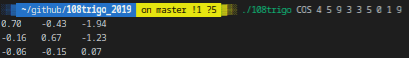
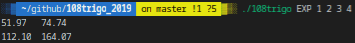
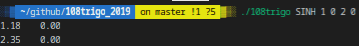

# 108trigo_2019

## DESCRIPTION
#### Further Fiddling with Fancy Fundamental Functions
As you may know (or not), the exponential function can be written as the sum of a power series. So does many other functions, such as trigonometric and hyperbolic functions. These power series are extremely handy when it comes to fast approximations of all those functions. But they can also be used to exponentiate (for instance) mathematical objects (as long as they can be elevated to integer powers). One could for example compute the cosine of a function, the exponentiation of a graph, the hyperbolic tangent of a rotation or the sine of a square matrix (which is what you will do here)...

Matrices are given as arguments line by line.

Given a matrix and the name of a function, your program must apply the latter to the former, and print the result.

## Prerequisites
What do you need to install ?
```bash
GlibC
gcc
make
```

## How to Build
Clone and go into `108trigo_2019` directory.
Then, 
```bash
$ make
```

## USAGE
Type `./108trigo -h` to display help
```bash
./108trigo fun a0 a1 a2 ...
```
| Option      | Description   |
| ----------- |:-------------:|
|fun | unction to be applied, among at least `EXP`, `COS`, `SIN`, `COSH` and `SINH` |
|ai | coeficients of the matrix |

## Example






## Summary
| Details      | Mouli Epitech (%) |
| ------------- |:-------------:|
| `basic`: 100% \| `cosine`: 100% \| `exponential`: 100% \| `hyperbolic cosine`: 100% \| `hyperbolic sine`: 100% \| `rigor`: 100% \| `sine`: 0% | 86.1% |

## WARNING
:warning: : For EPITECH Students, don't use this repository. Pay attention to :no_entry: 42