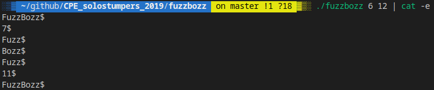

# CPE_solostumpers_2019

## DESCRIPTION

> EPITECH PROJECTS | solostumpers

## PREREQUISITES

What do you need to install ?
```bash
GlibC
gcc
make
```

## HOW TO BUILD
Clone and go into `CPE_solostumpers_2019` directory.
Then,
```bash
$ make
```

## DETAILS
| PROJECT      | DESCRIPTION   |
| ----------- |:-------------:|
| [anagram](anagram) |  |
| [boxerNameFormatter](boxerNameFormatter) |  |
| [clean_str](clean_str) |  |
| [countwords](countwords) |  |
| [fazzbizz](fazzbizz) |  |
| [fizzbuzz](fizzbuzz) |  |
| [fozzbazz](fozzbazz) |  |
| [frenchNameFormatter](frenchNameFormatte) |  |
| [fuzzbozz](fuzzbozz) |  |
| [geekNameFormatter](geekNameFormatter) |  |
| [hidenp](hidenp) |  |
| [palindrome](palindrome) |  |
| [rostring](rostring) |  |
| [rrostring](rrostring) |  |
| [sort_words](sort_words) |  |
| [USNameFormatter](USNameFormatter) |  |

## SUMMARY

> Most of these exams have not been marked.

## WARNING

:warning: : For EPITECH Students, don't use this repository. Pay attention to :no_entry: 42