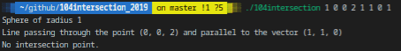
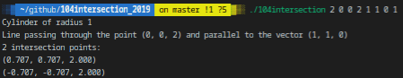
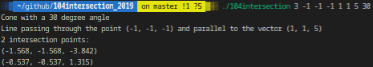

# 104intersection_2019

## DESCRIPTION
#### Third dimension and quadratic equations
Create synthesis images, potential intersection points between light rays and scene objects (here cylinders, spheres and cones). This is exactly what you have to do. To do so, you need to write a 3 dimensional equation of the straight line representing the light ray, and inject into it the equation of the considered surface. You’ll get a quadratic equation, with 0, 1 or 2 solutions, that will give you the intersection points coordinates (one do not take into account the possibility that the equation has an infinite number of solutions here).

The straight line is defined by the coordinates of a point by which it goes through and by the coordinates of a direction vector.

## Prerequisites
What do you need to install ?
```bash
GlibC
gcc
make
```

## How to Build
Clone and go into `104intersection_2019` directory.
Then, 
```bash
$ make
```

## USAGE
Type `./104intersection -h` to display help
```bash
./104intersection opt xp yp zp xv yv zv p
```
| Option      | Description   |
| ----------- |:-------------:|
|opt | surface option: `1` for a sphere, `2` for a cylinder, `3` for a cone |
|(xp, yp, zp) | coordinates of a point by which the light ray passes through |
|(xv, yv, zv) | coordinates of a vector parallel to the light ray |
|p	| radius of the sphere, radius of the cylinder, or angle formed by the cone and the Z-axis |

## Example
#### Sphere

#### Cylinder

#### Cone


## Summary
| Details      | Mouli Epitech (%) |
| ------------- |:-------------:|
| `rigor`: 84.2% \| `sphere`: 100% \| `cylinder`: 77.8% \| `cone`: 70% | 82.6% |

## WARNING
:warning: : For EPITECH Students, don't use this repository. Pay attention to :no_entry: 42