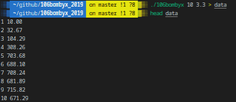
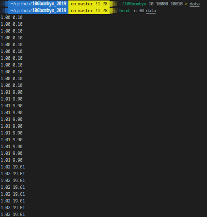
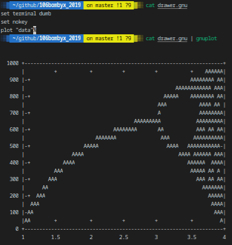

# 106bombyx_2019

## DESCRIPTION
#### Bombyx booming bylaw
Let’s call xi the number of the i'th generation of butterflys. Here is a model for the evolution of xi:

{ `x1 = n` where n is the number of first generation individuals }

{ `xi+1 = kxi * (1000−xi) / 1000` , for i ≥ 1, k being the growth rate, from 1 to 4. }

In order to study this evolution, you are asked to plot two things:

• The curve representing the number of individuals in relation to the generation (varying from 1 to 100).

• A synthetic scheme summing all the results for a given n; it consists in plotting every value of xi (between two given bounds), in relation to k (k varying from 1 to 4 by 0.01 steps).

In both cases, your program shall print on the standard outuput the values to be entered into gnuplot to draw the graphs.

## Prerequisites
What do you need to install ?
```bash
GlibC
gcc
make
```

## How to Build
Clone and go into `106bombyx_2019` directory.
Then, 
```bash
$ make
```

## USAGE
Type `./106bombyx -h` to display help
```bash
./106bombyx n [k | i0 i1]
```
| Option      | Description   |
| ----------- |:-------------:|
|n | number of first generation individuals |
|k | growth rate from 1 to 4 |
|i0 | initial generation (included) |
|i1	| final generation (included) |

## Example






## Summary
| Details      | Mouli Epitech (%) |
| ------------- |:-------------:|
| `basic`: 100% \| `mathematical rigor`: 50% \| `number of individuals`: 90% \| `rigor`: 100% \| `synthetic scheme`: 100% | 92.9% |

## WARNING
:warning: : For EPITECH Students, don't use this repository. Pay attention to :no_entry: 42

---

<div align="center">

<a href="https://github.com/blacky-yg" target="_blank"></a>

</div>