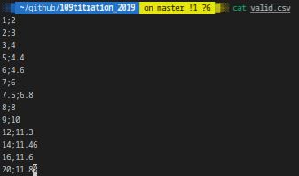
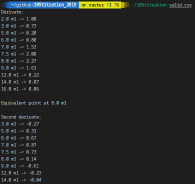

# 109titration_2019

## DESCRIPTION
#### Derivatives and Preservatives
The benzoic acid is used in industry as a food preservative under the E220 code. It is a white silky-looking solid. To determine the concentration of this additive in a soda, one can realize a pH titration: a strong base (the titrant) is progressively added to a sample of the soda (the analyte), and pH is then read. You must code the first approach here. Your program has to read titrant volume (in ml) and pH couples from a csv file, and output:
1. the derivative values for each given volume,
2. the closest point from the equivalence point amongst those given points,
3. the second derivative values for each given volume,
4. an estimate of the second derivative values every 0.1 ml around the above closest point from the equivalence point, using linear interpolation,
5. the proper equivalence point, estimated from the second derivative.

## Prerequisites
What do you need to install ?
```bash
GlibC
gcc
make
```

## How to Build
Clone and go into `109titration_2019` directory.
Then, 
```bash
$ make
```

## USAGE
Type `./109titration -h` to display help
```bash
./109titration file
```
| Option      | Description   |
| ----------- |:-------------:|
|file | a csv file containing “vol;ph” lines |

## Example




## Summary
| Details      | Mouli Epitech (%) |
| ------------- |:-------------:|
| `basic`: 0% \| `derivatives`: 0% \| `edge cases`: 100% \| `interpolation`: 0% \| `rigor`: 100% | 60% |

## WARNING
:warning: : For EPITECH Students, don't use this repository. Pay attention to :no_entry: 42