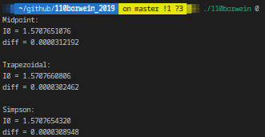

# 110borwein_2019

## DESCRIPTION
#### Saving years of calculations
In 2001, the Borwein brothers studied the following integrals, which now bear their name:
These integrals are remarkable because the first ones are all equal to π/2. An obvious conjecture would be that this is true for every value of n. Some decades ago, an old-school mathemacian would have had to hand-calculate the values of the first integrals (which would take several months, or even years), then assume all the integrals are equal to π/2 , and finally try and demonstrate this conjecture. Today, we can use numerical calculus to evaluate as many of these integrals as possible before getting into a demonstration; this is the goal of this project. You have to compute Borwein integrals, using the midpoint rule, the trapezoidal rule and the Simpson’s rule, and print both the value of I n and the absolute difference between In and π/2.
Since it is impossible to compute the integral between 0 et +∞, the uppper bound will be limited to 5000.
The integration interval must be divided into 10000 sub-intervals.

## Prerequisites
What do you need to install ?
```bash
GlibC
gcc
make
```

## How to Build
Clone and go into `110borwein_2019` directory.
Then, 
```bash
$ make
```

## USAGE
Type `./110borwein -h` to display help
```bash
./110borwein n
```
| Option      | Description   |
| ----------- |:-------------:|
|n | constant defining the integral to be computed |

## Example


## Summary
| Details      | Mouli Epitech (%) |
| ------------- |:-------------:|
| `simpson`: 100% \| `basic`: 100% \| `midpoint`: 100% \| `rigor`: 100% \| `trapezoidal`: 100% | 100% |

## WARNING
:warning: : For EPITECH Students, don't use this repository. Pay attention to :no_entry: 42

---

<div align="center">

<a href="https://github.com/blacky-yg" target="_blank"></a>

</div>