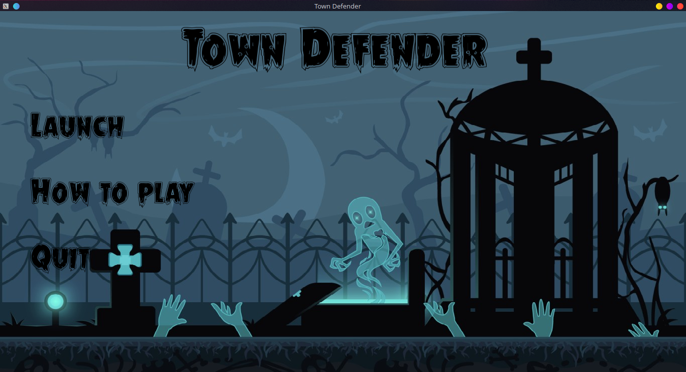
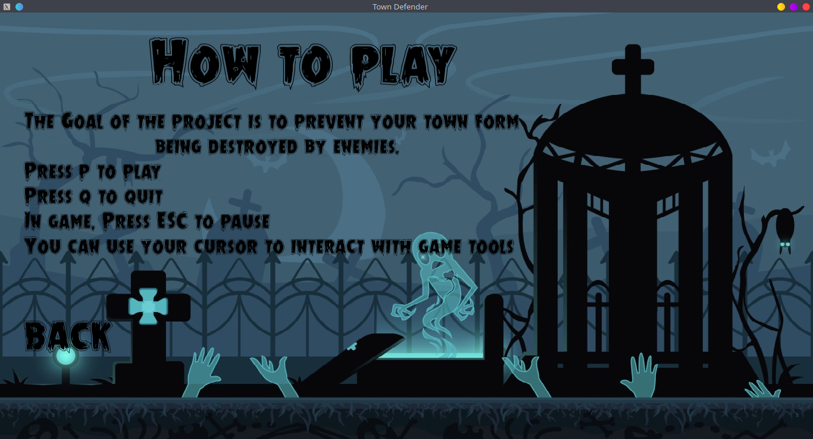
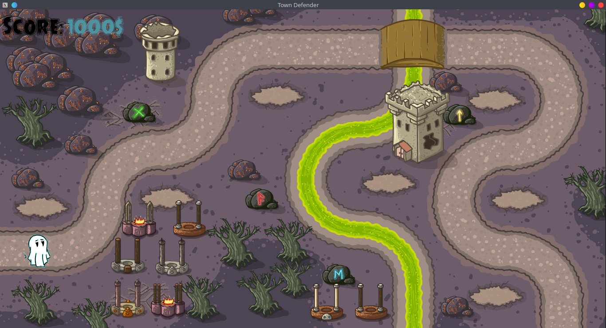
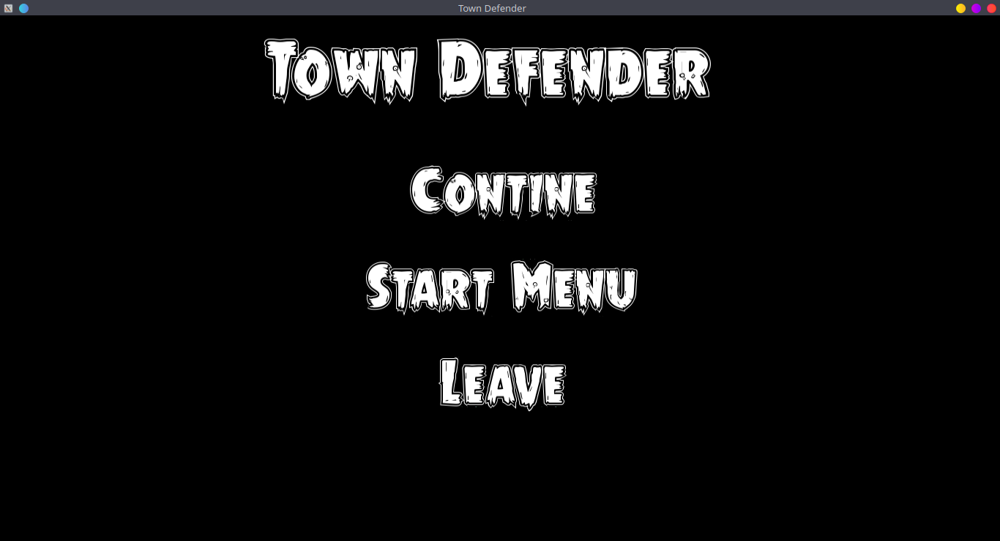

# defender

## DESCRITPION

This project is a Tower Defense game. A Good example of this kind of games is Revenge of the titans. Your main challenge for this game will be to create nice and smooth user interface and menus.
Your game must follow the following rules:

✓ The player is a builder who must defend his castle,

✓ Enemy waves will regularly appear from one side of the playground,

✓ The player must buy and place buildings on the playground grid to block/kill enemies,

✓ Buildings can be offensive (towers attacking) or defensive (basic walls),

✓ When the castle is reached by an enemy, it takes damages,

✓ If the castle reaches 0 hit points the player loose.

Having a pleasant user interface is one of the details that makes a good quality game, this project is the occasion for you to try your best on that topic.

## REALISATIONS
#### MANDATORY
The following features are mandatory (if your project is missing one of them it will not be evaluated further):

✓ the window can be closed using events.

✓ the game manages the input from the mouse click and keyboard.

✓ the game contains animated sprites rendered thanks to sprite sheets.

✓ animations in your program are frame rate independent.

✓ animations and movements in your program are timed by clocks.

#### MUST
The game must have:

✓ a starting menu with at least two buttons, one to launch a game, and one to quit the game.

✓ an escape key to pause the game when launched.

✓ a menu when the game is paused with at least three buttons, one to resume the game, one to go tothe starting menu and the one to leave the game.

✓ at least 4 different types of buildings (e.g. walls, slowing towers, damaging towers, etc... ).

✓ a building menu showing the different available buildings and their price.

✓ at least 2 different sound effects, and one looping background music.

## AUTHORIZED FUNCTIONS
All the functions from the CSFML and the math library are allowed.

From the libc, here is the full list of authorized functions:
- malloc
- getline
- (f)write
- free
- (f)open
- opendir
- memset
- (f)read
- readdir
- (s)rand
- (f)close
- closedir

## REQUIREMENTS
What do you need to install ?
```bash
GlibC
gcc
make
```
CSFML ([Download](https://www.sfml-dev.org/download/csfml/index-fr.php))

## How to Build
Clone and go into `defender` directory.
Then,
```bash
$ make
```

## USAGE
Type `./my_defender -h` to display help
```bash
./my_defender
```

## PREVIEW








## REVIEW PRESENTATION
([my_presentation](https://epitechfr-my.sharepoint.com/:p:/g/personal/hamidou_tessilimi_epitech_eu/EcNrs0E9RbZLoTyfMBHBkQgBLE4NkCI2rOEIF8mAI3w3Uw?e=QhfWed))

## WARNING
:warning: : For EPITECH Students, don't use this repository. Pay attention to :no_entry: 42