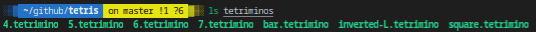
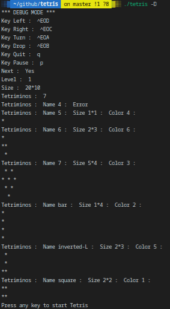

# PSU_tetris_2019

## DESCRIPTION
The goal of this project is to recreate the Tetris game in a UNIX terminal, with the Gameboy version rules.
You have to use ncurses. In the folder of your binary, there must be a tetriminos directory, which contains files that describe the game pieces.
These files are composed in the following way:

    • on the first line, the size and color of the piece in this format: width height color_code\n (the number of the color corresponds to the ncurses capacity’s color numbers),
    • on the h following lines (where h is the height of the tetrimino), the piece’s shape composed with asterisks (*) and spaces (' ').

The pieces (randomly chosen) fall from the top of the map and pile up on the bottom. Each time a line is completed, it disappears, leaving all of the pieces above it to fall.
The level increases by 1 for every 10 deleted lines. The falling speed increases proportionally to the level.
When it is no longer possible for pieces to fall from the top of the map, the player loses.

## Prerequisites
What do you need to install ?
```bash
GlibC
gcc
make
ncurses
```

## How to Build
Clone and go into `tetris` directory.
Then,
```bash
$ make
```

## USAGE
Type `./tetris --help` to display help
```c
./tetris --help | cat -e
Usage: ./tetris [options]$

Options:$
    --help               Display this help$
    -L --level={num}     Start Tetris at level num (def: 1)$
    -l --key-left={K}    Move the tetrimino LEFT using the K key (def: left arrow)$
    -r --key-right={K}   Move the tetrimino RIGHT using the K key (def: right arrow)$
    -t --key-turn={K}    TURN the tetrimino clockwise 90d using the K key (def: top
    arrow)$
    -d --key-drop={K}    DROP the tetrimino using the K key (def: down arrow)$
    -q --key-quit={K}    QUIT the game using the K key (def: ‘q’ key)$
    -p --key-pause={K}   PAUSE/RESTART the game using the K key (def: space bar)$
    --map-size={row,col} Set the numbers of rows and columns of the map (def: 20,10)$
    -w --without-next   Hide next tetrimino (def: false)$
    -D --debug          Debug mode (def: false)$
```

## Example





## Review Presentation
([my_presentation](https://prezi.com/view/0Z6n57bCcbChjNOzKJ6S/))

## Summary
| Details      | Mouli Epitech (%) |
| ------------- |:-------------:|
| `Bad parameter`: 0% \| `Debug Mode - Read Tetriminos`: 47.1% \| `Debug Mode - Read Tetriminos : Subject sample`: 100% \| `Debug Mode - Read capacities`: 50% \| `Display help`: 100% \| `Testing Parameters`: 0% | 41.2% |

## WARNING
:warning: : For EPITECH Students, don't use this repository. Pay attention to :no_entry: 42

---

<div align="center">

<a href="https://github.com/blacky-yg" target="_blank"></a>

</div>