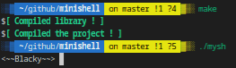
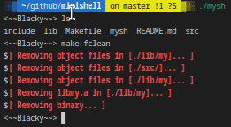
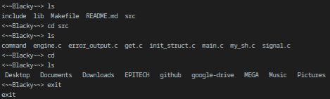

# PSU_minishell2_2019

## DESCRIPTION
You have to program a UNIX command interpreter.
The interpreter is expected to display a prompt ($>, for example) and then wait for you to write a command line, which must be validated by a newline.

The prompt must be displayed again only after the command execution.
Only basic command lines are expected to executed; no pipes, redirections or any other advanced features.
The executables should be those found in the path, as indicated in the PATH variable.

If the executable cannot be found, you must display an error message and display the prompt again.
Errors must be dealt with and must display the appropriate message on the error output.

You must correctly handle the PATH and the environment (by copying and restoring the initial env).
You must implement the following builtins: cd, setenv, unsetenv, env, exit.

Your env builtin hasn’t to take any argument. Your unsetenv builtin hasn’t to support the "*" wildcard.

## AUTHORIZED FUNCTIONS
    - malloc, free, exit, opendir, readdir, closedir, getcwd, chdir
    - fork, stat, lstat, fstat, open, close, getline
    - read, write, execve, access, isatty, wait, waitpid
    - wait3, wait4, signal, kill, getpid, strerror, perror, strsignal

## Prerequisites
What do you need to install ?
```bash
GlibC
gcc
make
```

## How to Build
Clone and go into `minishell` directory.
Then, 
```bash
$ make
```

## USAGE
```bash
./mysh
```

## Example






## Summary
| Details      | Mouli Epitech (%) |
| ------------- |:-------------:|
| `basic tests`: 60% \| `path handling`: 40% \| `setenv and unsetenv`: 0% \| `builtin cd`: 66.7% \| `line formatting (space and tabs)`: 100% \| `error handling`: 0% | 39.2% |

## WARNING
:warning: : For EPITECH Students, don't use this repository. Pay attention to :no_entry: 42

---

<div align="center">

<a href="https://github.com/blacky-yg" target="_blank"></a>

</div>