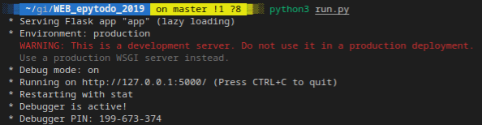
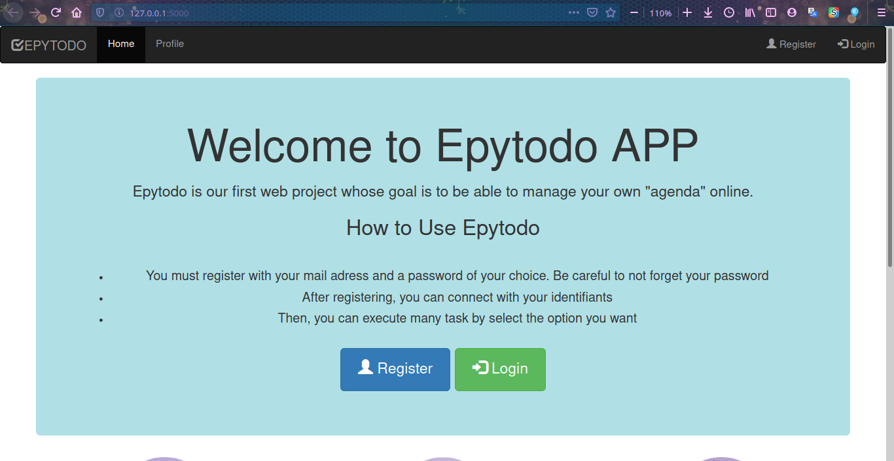
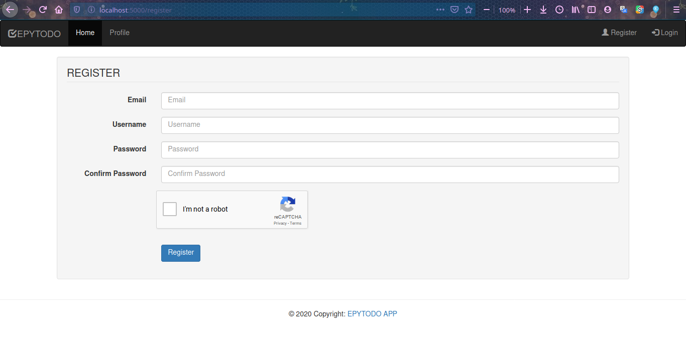
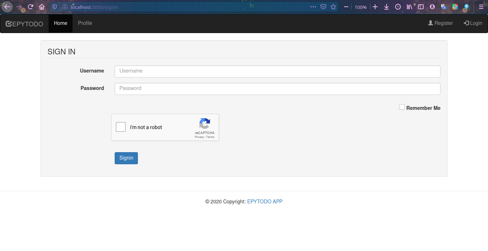
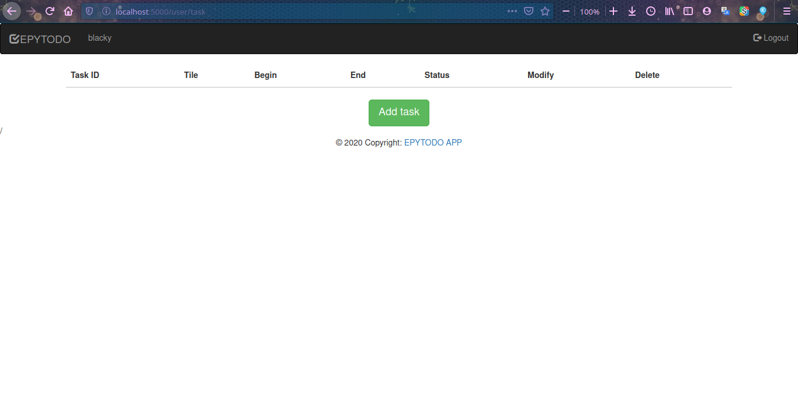

# WEB_epytodo_2019

## DESCRIPTION
EPyTodo is a project on which you could rely in the future. Thanks to it, you’ll be able to handle all the tasks you need to do easily! Within this project, you’ll have to develop:
1. your MySQL database scheme (Its tables are named user, task and user_has_task)
2. your web server using Flask
3. your HTML pages using Jinja2 (integrated with Flask)

## REQUIREMENTS
What do you need to install ?
```bash
$ source venv/bin/activate
$ pip install -r requirements.txt
```

#### Set up Migrations
```
$ python manage.py db init
$ python manage.py db migrate
$ python manage.py db upgrade
```

## Run
Clone and go into `WEB_epytodo_2019` directory.
Then,
```bash
$ python3 run.py
```

## Examples
`Run`



`Home Page`



`Register Page`



`Login Page`



`User page (Dashboard)`



## Review Presentation
([my_presentation](https://prezi.com/view/yrcWL7H5QRAz64HGoNq5/))

## WARNING
:warning: : For EPITECH Students, don't use this repository. Pay attention to :no_entry: 42

---

<div align="center">

<a href="https://github.com/blacky-yg" target="_blank"></a>

</div>